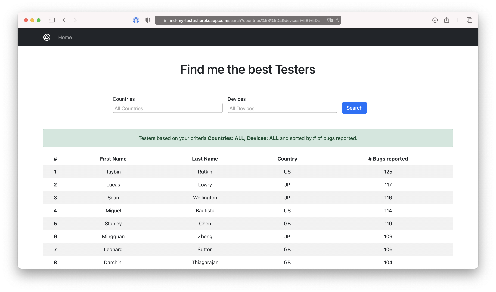

# FindMyTester
An Applause preview

## Technologies used
* Ruby 3.0.0
* Ruby on Rails 6.1
* PostgreSQL 13.1
* Nodejs 15.8.0
* Yarn >= 1.22
* Bootstrap 5.0

## How to run it locally
* Clone the repo into your local machine
* Get Ruby `v3.0.0` installed
* Get PostgreSQL `v13.1` installed
* Get Nodejs `v15.8.0` installed
* Run `bundle install`
* Run `yarn install`
* Copy `config/database.example.yml` to `config/database.yml` and fill in with appropriate details
* Setup the database: `bundle exec rails db:create db:schema:load`
* Seed the database with sample data: `bundle exec rails db:seed`
* Run the project: `bundle exec rails s`
* If everything is okay, it should boot up at `http://localhost:5445`
* Open your favourite browser and hit `http://localhost:5445`, you should see the webpage.
* You can run the test suit with `bundle exec rspec`.
